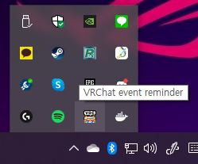

VRChat event reminder
=====================

- [ダウンロード (Alpha 0.0.3)](https://github.com/Kyeong-min/VRChat-event-reminder-client/releases/tag/0.0.3-alpha)

このアプリは、VRChatで開催される、様々にイベントに忘れずに参加できるようにお助けします。

指定されたイベントが開催される前に、Windows toast notificationおよび、VR HMD上でオーバーレイでお知らせします。

# 現在当アプリはαテスト版です。

- インストーラ
  - α版では、圧縮ファイルの形で提供されます。

# このアプリをお使いになるためには、下記の条件を満たす必要があります。

## 必須
- ウィンドウズ10 64ビット
- .NET Framework 4.7.2 Runtime [ダウンロード](http://go.microsoft.com/fwlink/?LinkId=863262)

## オプション
- Valve index、HTC Vive、Oculus、Windows MR など、SteamVRをサポートするVRハードウェア
- SteamVR

````
VRハードウェアおよび、SteamVRがインストールされていない環境では、Windows toast notificationを通じてのみ、イベントの開催をお知らせできます。
````

# このアプリの構成要素について
ダウンロードした圧縮ファイルを任意のフォルダーに解凍し、下記の構成要素をご確認ください。

1. VRChatEventReminder フォルダー
   * VRChat Event Reminder 本体です。
2. NotificationBroker フォルダー
   * イベントのアラームをVR HMD上で表示するための構成要素です。
3. NDP472-KB4054531-Web.exe
   * VRChat Event Reminderの起動するため必要な .NET Framework Runtimeです。
4. VC_redist.x64.exe
   * NotificationBrokerを起動するため必要な再頒布可能パッケージです。
5. ReadMe.xx-xx.txt
   * 簡単な説明です。

# インストール手順
1. ダウンロードしたalpha_x.x.x.zip 파일의 압축을 해제합니다.
2. NDP472-KB4054531-Web.exeを起動し、指示に従い、ランタイムをインストールします。
   * 既にインストール済みであれば、インストールする必要はありません。
3. NotificationBroker\manifest_install.bat ファイルを実行します。
   * SteamVR起動の際、NotificationBrokerが自動的に起動されるため、SteamVRに登録します。
   * 実行した際、エラーメッセージが出なければOKです。
   * もし、DLL関連のエラーが生じる場合、VC_redist.x64.exeを起動し、再頒布可能パッケージをインストールしてください。
   * dll 関連問題以外のエラーが生じた場合、エラーの内容と、NotificationBrokerフォルダーのlogger.logをHATENAまで送っていただくと助かります。

# 簡単なHow to use.
1. VRChatEventReminderフォルダーのVRChatEventReminder.exeファイルを実行してください。

2. タスクトレイアイコンから、VRChat event reminderをダブルクリック、又はマウス右クリック→Openを押下してください。

3. 左のメニューから、イベントリストをクリックしてください。

  - End アイコンが表示されているイベントは、終了されています。アラームの設定はできません。
  - 再生ボタンアイコン(▶)の表示されたイベントは現在開催中のイベントです。イベントの進行度を確認できます。アラームの設定はできません。
  - 背景のないBellアイコンは、アラームを設定していないイベントです。このアイコンをクリックすることで、イベントに対してアラームを設定できます。
  - 背景のあるBellアイコンは、アラーム設定済みのイベントです。このイベントは開催15分前、開催する際にアラームをもらうことができます。このアイコンをクリックすることで、イベントに対するアラームを解除できます。
4. イベントリストから、イベントをクリックすることで、イベントに対する詳細情報が見れます。

  - イベントの概要、開始時刻、終了時刻、情報の更新時刻、イベントの詳細情報が見れます。
  - できるのであれば、イベントに対する広告イメージを表示します。
  - イメージが表示されている場合に限って、イメージをクリックして全体イメージが見れます。

## VR HMDでアラームを見るために
インストール手順３のNotificationBroker\manifest_install.batファイルを実行しましたら、下記１，２の手順は不要です。
SteamVR起動時に自動的にNotificationBrokerが自動的に起動され、HMD上にアラームが表示できます。

1. NotificationBroker/NotificationBroker.exeファイルを起動してください。
   - この際、SteamVRが起動中でない場合、SteamVRが自動で起動されます。
2. イベントが開催される前に、イベントの開催を知らせるアラームをVR HMD上で見れます。
3. SteamVR Dashboardから、VRChat event reminderのダッシュボードを通じて、アラームの見え方を設定できます。

4. オーバーレイの表示位置、スケール、透明度、表示時間を設定し、Show sample notificationボタンをインタラクティブ(大体の場合、コントローラのトリガーボタンまたは、HMDのセレクトボタン)することで、テストできます。


# このアプリの不具合について
どういう操作を行い、どの問題が発生したかを私に教えてくださると、テストおよび、開発において、大変な助かりとなります。

下記の中から、楽な方法を利用して、私に教えてください。

- ツイッター @isHATENA にて、DMを送ってください。
- [Github repository](https://github.com/Kyeong-min/VRChat-event-reminder-client/issues)にて、issueを切ってください。

私にお知らせの際、ログファイルを一緒にいただくと大変助かります。
- VRChatEventReminder\log\ の中のすべての *.log ファイル
- NotificationBroker\logger.log ファイル

# About
- 開発: HATENA([@isHATENA](https://twitter.com/isHATENA))
- アイコン: コールマン＆アルナイル([@callman_alnair](https://twitter.com/callman_alnair))

## VRChatイベント開催情報について
現在、VRChat event reminderから提供しているVRChatのイベント情報は、下記のイベント開催情報からいただいております。   
各イベント開催情報の運営管理者にて、情報使用に対する許可を得ております。
- VRChat イベントカレンダー
  - https://sites.google.com/view/vrchat-event
  - 運営管理者 カッコウ ([@nest_cuckoo_](https://twitter.com/nest_cuckoo_))
- 한국 VRChat 이벤트 캘린더
  - https://sites.google.com/view/vrcevent-kr
  - 運用管理者 R3C0D3r([@r3c0d3r](https://twitter.com/r3c0d3r))

## VRChatイベント開催情報の責任範囲について
- 各イベント開催情報の権利は、原則、各イベント開催情報の運営管理者が保持します。
- イベント開催情報の登録、修正などに対しては、各イベント開催情報の運営管理者の責任範囲です。
  - イベントの登録、修正、削除など、イベント情報に関する依頼、問い合わせは、各イベント情報の管理運営者まで連絡してください。
- 本アプリ(VRChat event reminder)の不具合、更新などは開発のHATENAの責任範囲です。
  - 不具合、改善要望などの、このアプリに関する依頼、問い合わせは、開発者のHATENAにご連絡ください。