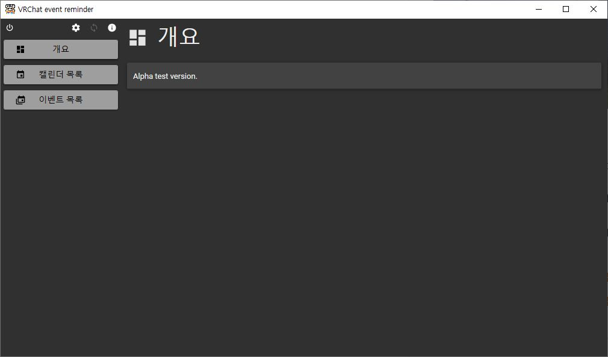
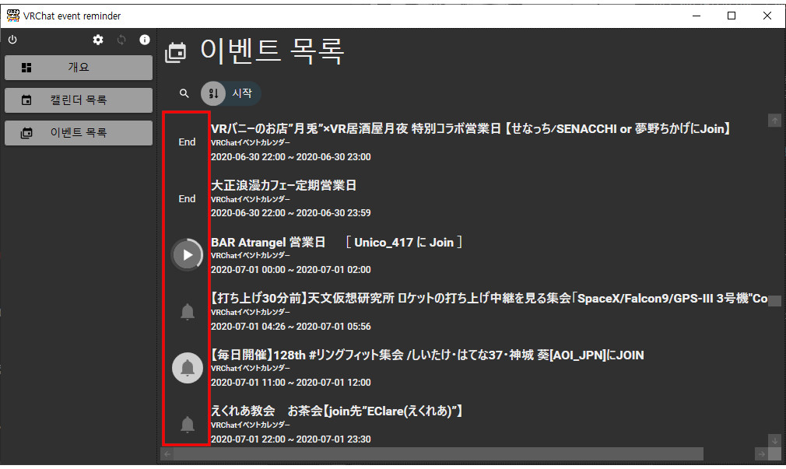
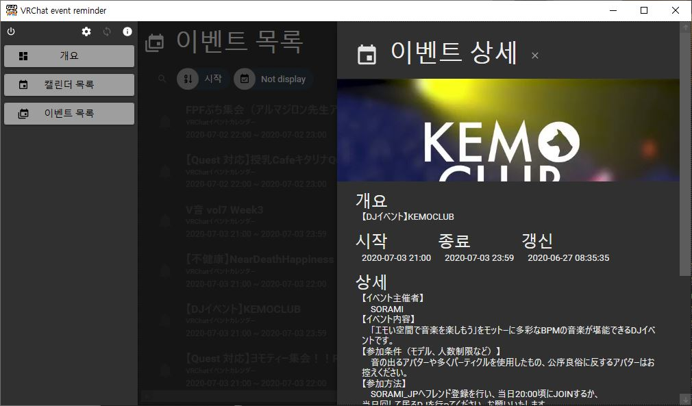

VRChat event reminder
=====================

- [다운로드 (Alpha 0.0.3)](https://github.com/Kyeong-min/VRChat-event-reminder-client/releases/tag/0.0.3-alpha)

이 프로그램은 VRChat에서 개최되는 여러 이벤트에 잊지 않고 참여할 수 있도록 도와줍니다.

지정한 이벤트가 개최되기 전에 Windows toast notification 및 VR HMD에 오버레이로 알려줍니다.

# 현재 이 프로그램은 알파테스트중입니다.

- 인스톨러를 이용한 설치
  - Alpha버전에서는 압축 파일 형태로 제공됩니다.

# 이 프로그램을 사용하기 위해서는 아래의 조건을 만족햐여야 합니다.

## 필수
- Windows 10 64bit
- .NET Framework 4.7.2 Runtime [다운로드](http://go.microsoft.com/fwlink/?LinkId=863262)

## 선택
- Valve index, HTC Vive, Oculus, Windows MR 등, SteamVR 호환 VR 하드웨어
- SteamVR

````
VR하드웨어 및 SteamVR이 설치되어 있지 않은 환경에서는 Windows toast notification을 통해서만 이벤트를 알립니다.
````

# 프로그램의 구성 요소
다운받은 프로그램의 압축을 임의의 폴더에 해제하고 아래 구성 요소를 확인해주십시오.

1. VRChatEventReminder 폴더
   * VRChat Event Reminder 본체입니다.
2. NotificationBroker 폴더
   * 이벤트 알람을 VR HMD에 표시하기 위한 구성 요소입니다.
3. NDP472-KB4054531-Web.exe
   * VRChat Event Reminder를 실행하기 위한 .NET Framework Runtime입니다.
4. VC_redist.x64.exe
   * NotificationBroker를 실행하기 위한 재배포 가능 패키지입니다.
5. ReadMe.xx-xx.txt
   * 간단한 설명입니다.

# 설치방법
1. 다운로드 한 후 alpha_x.x.x.zip 파일의 압축을 해제합니다.
2. NDP472-KB4054531-Web.exe를 실행하여 지시에 따라 설치합니다.
   * 이미 설치되어 있다면 설치하지 않아도 됩니다.
3. NotificationBroker\manifest_install.bat 파일을 실행합니다.
   * SteamVR이 실행될 때 NotificationBroker가 자동으로 실행되도록 SteamVR에 등록합니다.
   * 실행하였을 때 아무런 에러도 발생하지 않는다면 성공입니다.
   * 만약 컴퓨터에 MSVxxxxx.dll이 없어 실행할 수 없다는 에러가 발생할 경우, VC_redist.x64.exe를 실행하여 재배포 가능 패키지를 설치해주십시오.
   * dll 관련 문제 이외의 에러가 발생하였다면 에러 메시지 내용과 NotificationBroker\logger.log파일을 HATENA에게 보내주십시오.


# 간단한 사용법
1. VRChatEventReminder 폴더의 VRChatEventReminder.exe 파일을 실행합니다.

2. 트레이 아이콘에서 VRChat event reminder 아이콘을 더블클릭 혹은 마우스 우클릭 -> Open을 클릭합니다.

3. 좌측 메뉴에서 이벤트 목록 버튼을 클릭합니다.

  - End 아이콘이 표시되는 이벤트는 종료된 이벤트입니다. 알람을 설정할 수 없습니다.
  - 재생 버튼(▶) 아이콘이 표시된 이벤트는 현재 진행중인 이벤트입니다.   이벤트 진행도를 확인할 수 있으며 알람을 설정할 수 없습니다.
  - 배경 없는 벨 아이콘은 알람을 설정하지 않은 이벤트입니다. 이 아이콘을 클릭해서 알람을 설정할 수 있습니다.
  - 배경 있는 벨 아이콘은 알람을 설정한 이벤트입니다. 이 이벤트는 시작하기 15분 전, 시작할 때 알람을 받을 수 있습니다. 이 아이콘을 클릭해서 알람 설정을 해제할 수 있습니다.
4. 이벤트 목록에서 이벤트를 클릭하면 이벤트에 대한 상세 정보를 확인할 수 있습니다.

  - 이벤트의 개요, 시작시각, 종료시각, 정보 갱신 시각, 이벤트 상세 정보를 확인할 수 있습니다.
  - 가능한 경우 이벤트에 대한 홍보 이미지를 표시합니다.
  - 이미지가 표시되는 경우에 한하여 이미지를 클릭하면 전체 사이즈 이미지가 표시됩니다.

## VR HMD에서 알림을 받기 위해서
설치방법에 따라 3. NotificationBroker\manifest_install.bat 파일을 실행했다면 아래 1, 2는 무시하셔도 됩니다.
SteamVR을 실행하면 자동으로 NotificationBroker가 실행되고 HMD상에 알람이 표시됩니다.   

1. NotificationBroker/NotificationBroker.exe 파일을 실행합니다.
   - 이 때, SteamVR이 실행되어있지 않다면 자동으로 실행됩니다.
2. 이제 이벤트에 대한 알람을 VR HMD에서 확인할 수 있습니다.
3. SteamVR Dashboard에서 VRChat event reminder 대시보드를 통해 알람의 표시 방법을 설정할 수 있습니다.

4. 오퍼레이의 표시 위치, 크기, 투명도, 표시시간을 설정하고 Show sample notification 버튼 상호작용(대부분의 경우 컨트롤러의 트리거 혹은 HMD의 선택 버튼)을 통해 테스트할 수 있습니다.


# 프로그램을 사용함에 있어 버그 등의 문제가 발생한 경우
어떤 조작을 하여서 무슨 문제가 발생하였는지 알려주신다면 테스트 및 개발에 큰 도움이 됩니다.

아래 두가지 방법 중 한가지 방법으로 저에게 알려주세요.

- 트위터 @isHATENA 에게 DM으로 알려주세요.
- [Github repository](https://github.com/Kyeong-min/VRChat-event-reminder-client/issues)에 issue를 만들어주세요.

저게에 알려주실 때 로그 파일을 함께 제공해주시면 문제 해결에 도움이 됩니다.
- VRChatEventReminder\log\ 경로에 있는 모든 *.log 파일
- NotificationBroker\logger.log 파일

# About
- 개발: HATENA([@isHATENA](https://twitter.com/isHATENA))
- 아이콘: コールマン＆アルナイル([@callman_alnair](https://twitter.com/callman_alnair))
  
## VRChat 이벤트 개최 정보에 대하여
현재 VRChat event reminder에서 제공중인 이벤트는 아래 이벤트 개최 정보로부터 받고 있습니다.   
각 이벤트 개최 정보의 관리운영자에게 정보 사용에 대한 허가를 받고 있습니다.
- VRChat イベントカレンダー
  - https://sites.google.com/view/vrchat-event
  - 관리운영자 カッコウ ([@nest_cuckoo_](https://twitter.com/nest_cuckoo_))
- 한국 VRChat 이벤트 캘린더
  - https://sites.google.com/view/vrcevent-kr
  - 관리운영자 R3C0D3r([@r3c0d3r](https://twitter.com/r3c0d3r))

## VRChat 이벤트 개최 정보의 책임범위에 대해서
- 각 이벤트 개최 정보의 권리는 원칙적으로 각 이벤트 개최 정보의 관리운영자가 가지고 있습니다.
- 이벤트 정보의 등록 및 수정에 대해서는 각 이벤트 개최 정보의 관리운영자의 책임 범위입니다.
  - 이벤트 정보의 등록, 수정, 삭제 의뢰는 각 이벤트 개최 정보의 관리운영자에게 연락해주십시오.
- 이 프로그램(VRChat event reminder)에서 발생하는 버그 및 갱신은 개발자 HATENA의 책임범위입니다.
  - 버그, 개선사항 등 이 프로그램에 대한 연락은 개발자 HATENA에게 연락해주십시오.
